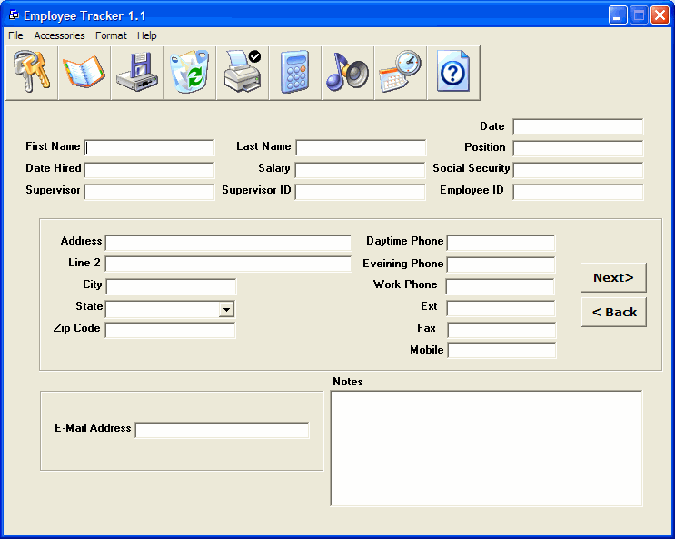



## Employee Tracker v1\.1

### Description

I have worked out all the bugs in this realse, I changed the UI a little but it's still the great looking employee database. PLEASE RATE IT IF YOU LIKE IT . Any comments are welcome. The User Name and Password is "admin"
 
### More Info
 

             |
---                |---
**Submitted On**   |2001-12-26 19:26:10
**By**             |[Karl Most](https://github.com/Planet-Source-Code/PSCIndex/blob/master/ByAuthor/karl-most.md)
**Level**          |Advanced
**User Rating**    |5.0 (45 globes from 9 users)
**Compatibility**  |VB 5\.0, VB 6\.0
**Category**       |[Databases/ Data Access/ DAO/ ADO](https://github.com/Planet-Source-Code/PSCIndex/blob/master/ByCategory/databases-data-access-dao-ado__1-6.md)
**World**          |[Visual Basic](https://github.com/Planet-Source-Code/PSCIndex/blob/master/ByWorld/visual-basic.md)
**Archive File**   |[Employee\_T42543121620\.zip](https://github.com/Planet-Source-Code/karl-most-employee-tracker-v1-1__1-29856/archive/master.zip)

